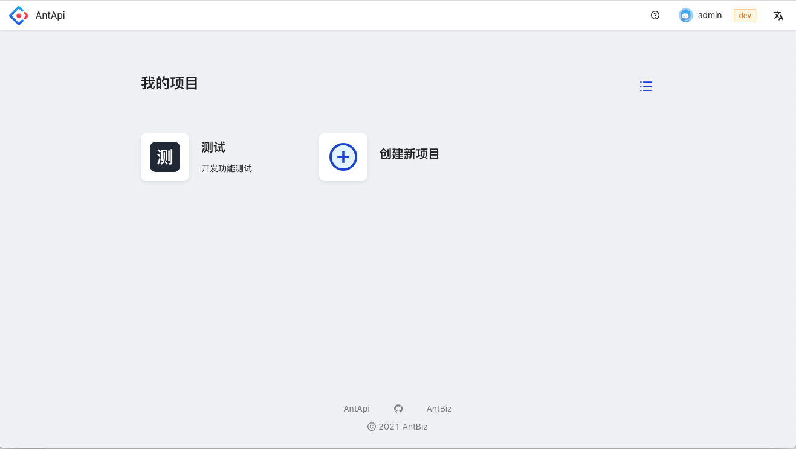
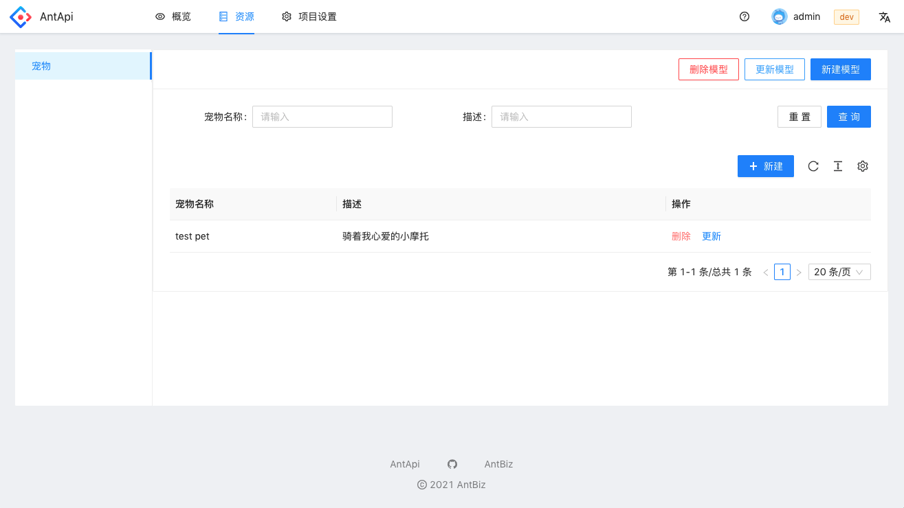
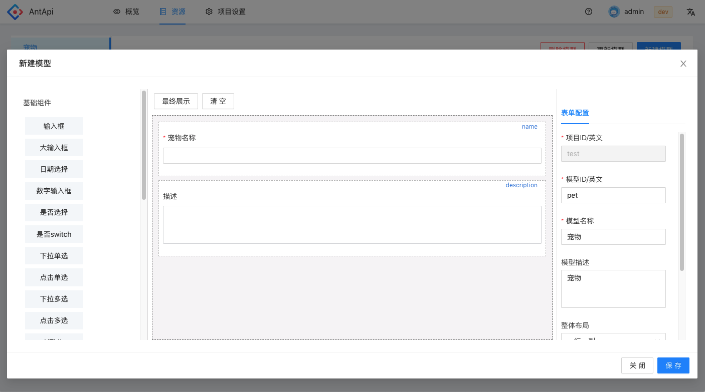
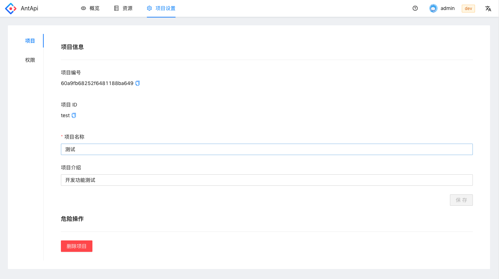
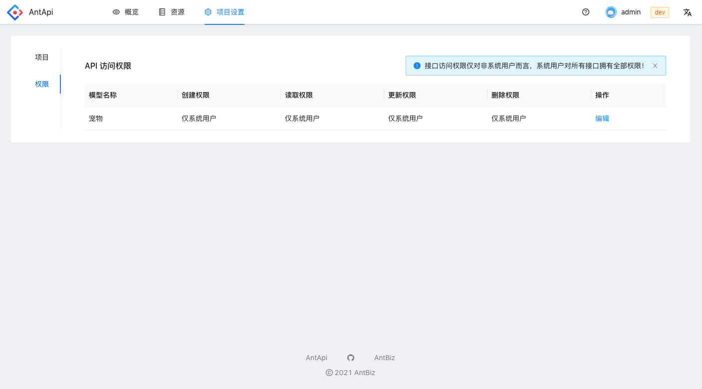
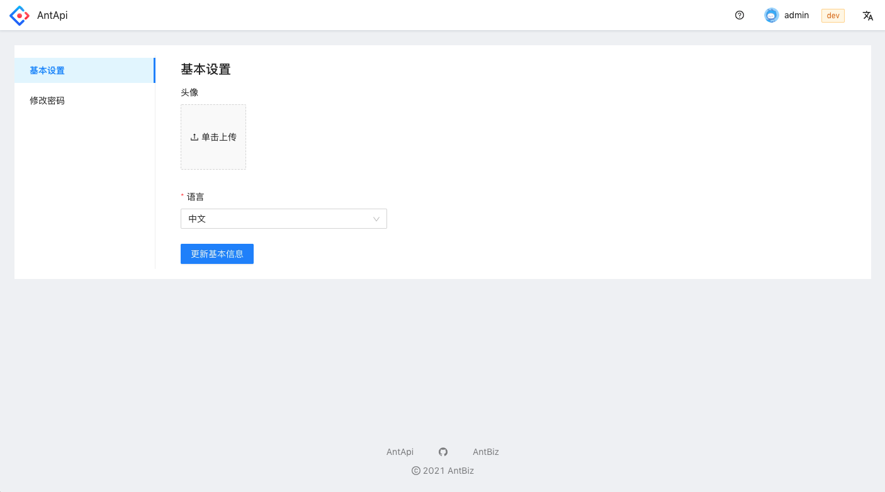

<h3 align="center">
  <a href="">AntApi</a>
   
  
🚀开源Golang无头CMS, 轻松构建可定制API

</h3>

无需写代码，通过后台拖拽表单即可轻松构建 高效、安全、快速 的接口

<a href="">在线体验</a>

AntApi 是一款免费开源的无头 CMS, 帮助您轻松构建 API 并同时自带管理后台

- **快、体验好：** 后端基于go，数据库使用mongodb，管理后台使用 ts + ant-design
- **免费开源：** 您可以部署在自己的服务器上
- **简单高效：** 无需关心后端，只需要在前端拖拽设计表单
- **业务逻辑可扩展：** crud通过钩子来帮助处理自定义业务逻辑

| 技术栈 | 说明 |
| -----------| ----- |
| Golang     | 后端编程语言 |
| GoFrame    | go web 框架 |
| Mongodb    | 数据库 |
| TS         | 前端编程语言 |
| React      | 前端框架 |
| Ant-Design | 管理后台ui框架 |
| Form-Render | 阿里开源的基于schema的表单构建框架 |

## 预览图

  
  

  
  

  
  

## 开始
### ⏳ 安装/部署
### 👷 本地开发
### 🖐 依赖

## License

See the [LICENSE](./LICENSE) file for licensing information.